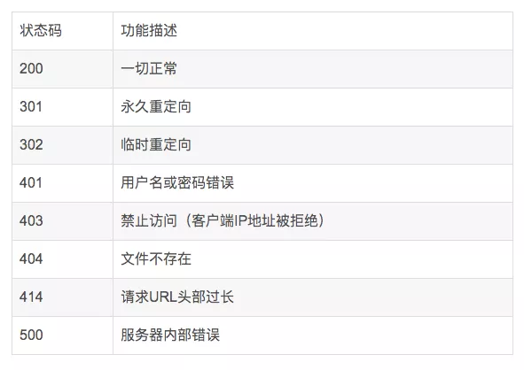
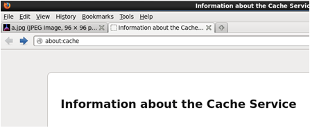
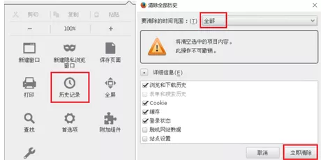

Nginx 是一个很强大的高性能 Web 和反向代理服务，它具有很多非常优越的特性，在连接高并发的情况下，Nginx 是 Apache 服务不错的替代品。其特点是占有内存少，并发能力强，事实上 nginx 的并发能力在同类型的网页服务器中表现较好，因此国内知名大厂例如：淘宝，京东，百度，新浪，网易，腾讯等等都在使用 Nginx 网站。

在我们的日常工作学习中，我们会该如何去优化自己的 Nginx 服务器？遇到以下问题我们该如何处理呢？

### 一、自定义返回客户端的404错误页面

1）优化前，客户端使用浏览器访问不存在的页面，会提示404文件未找到

```
# firefox http://192.168.4.5/xxxxx //访问一个不存在的页面
```

2）修改 Nginx 配置文件，自定义报错页面

```linux
[root@proxy ~]# vim /usr/local/nginx/conf/nginx.conf
charset utf-8;       //仅在需要中文时修改该选项error_page   
404  /404.html;      //自定义错误页面

# vim /usr/local/nginx/html/404.html  
//生成错误页面Oops,No NO no page …

# nginx -s reload
# 请先确保 nginx 是启动状态，否则运行该命令会报错,报错信息如下：#[error] open() "/usr/local/nginx/logs/nginx.pid" failed (2: No such file or directory)
```

3）优化后，客户端使用浏览器访问不存在的页面，会提示自己定义的 40x.html 页面

```
# firefox http://192.168.4.5/xxxxx //访问一个不存在的页面
```

常见的 http 状态码可用参考表所示



### 二、查看服务器状态信息

1）编译安装时使用`--with-http_stub_status_module`开启状态页面模块

```
# tar -zxvf nginx-1.12.2.tar.gz
# cd nginx-1.12.2
# ./configure   \
> --with-http_ssl_module           //开启SSL加密功能
> --with-stream                    //开启TCP/UDP代理模块
> --with-http_stub_status_module   //开启status状态页面

# make && make install             //编译并安装
```

2）启用 Nginx 服务并查看监听端口状态

ss 命令可以查看系统中启动的端口信息，该命令常用选项如下：

- -a 显示所有端口的信息
- -n 以数字格式显示端口号
- -t 显示TCP连接的端口
- -u 显示UDP连接的端口
- -l 显示服务正在监听的端口信息，如httpd启动后，会一直监听80端口
- -p 显示监听端口的服务名称是什么（也就是程序名称）

注意：在 RHEL7 系统中可以使用ss命令替代 netstat 命令，功能一样，选项一样。

```
# /usr/local/nginx/sbin/nginx
# netstat  -anptu  |  grep nginx
tcp        0        0 0.0.0.0:80        0.0.0.0:*        LISTEN      10441/nginx
# ss  -anptu  |  grep nginx
```

3）修改 Nginx 配置文件，定义状态页面

```
# cat /usr/local/nginx/conf/nginx.conf

location /status {                
stub_status on;                 
#allow IP地址;                 
#deny IP地址;        
}

# /usr/local/nginx/sbin/nginx -s reload
```

4）优化后，查看状态页面信息

```
# curl  http://192.168.4.5/status
Active connections: 1 
server accepts handled requests 
10 10 3 
Reading: 0 Writing: 1 Waiting: 0
```

Active connections：当前活动的连接数量。
Accepts：已经接受客户端的连接总数量。
Handled：已经处理客户端的连接总数量。
（一般与accepts一致，除非服务器限制了连接数量）。
Requests：客户端发送的请求数量。
Reading：当前服务器正在读取客户端请求头的数量。
Writing：当前服务器正在写响应信息的数量。
Waiting：当前多少客户端在等待服务器的响应。

### 三、优化 Nginx 并发量

1）优化前使用ab高并发测试

```
# ab -n 2000 -c 2000 http://192.168.4.5/
Benchmarking 192.168.4.5 (be patient)
socket: Too many open files (24)                //提示打开文件数量过多
```

2）修改 Nginx 配置文件，增加并发量

```
# vim /usr/local/nginx/conf/nginx.conf
.. ..
worker_processes  2;                    //与CPU核心数量一致
events {
worker_connections 65535;        //每个worker最大并发连接数
}
.. ..
# /usr/local/nginx/sbin/nginx -s reload
```

3）优化 Linux 内核参数（最大文件数量）

```
# ulimit -a                        //查看所有属性值
# ulimit -Hn 100000                //设置硬限制（临时规则）
# ulimit -Sn 100000                //设置软限制（临时规则）
# vim /etc/security/limits.conf    
.. ..
*               soft    nofile            100000
*               hard    nofile            100000

#该配置文件分4列，分别如下：10.#用户或组    硬限制或软限制    需要限制的项目   限制的值
```


4）优化后测试服务器并发量（因为客户端没调内核参数，所以在proxy测试）

```
# ab -n 2000 -c 2000 http://192.168.4.5/
```

### 四、优化 Nginx 数据包头缓存

1）优化前，使用脚本测试长头部请求是否能获得响应

```
[root@proxy ~]# cat lnmp_soft/buffer.sh 
#!/bin/bash
URL=http://192.168.4.5/index.html?
for i in {1..5000}
do
	URL=${URL}v$i=$i
done
curl $URL                                //经过5000次循环后，生成一个长的URL地址栏

[root@proxy ~]# ./buffer.sh
.. ..
<center><h1>414 Request-URI Too Large</h1></center>        //提示头部信息过大
```

2）修改 Nginx 配置文件，增加数据包头部缓存大小

```
# vim /usr/local/nginx/conf/nginx.conf
... ..
http {
client_header_buffer_size    1k;        //默认请求包头信息的缓存    large_client_header_buffers  4 4k;      //大请求包头部信息的缓存个数与容量
.. ..
}

# /usr/local/nginx/sbin/nginx -s reload
```

3）优化后，使用脚本测试长头部请求是否能获得响应

```
[root@proxy ~]# cat buffer.sh 
#!/bin/bash
URL=http://192.168.4.5/index.html?
for i in {1..5000}
do
	URL=${URL}v$i=$i
done
curl $URL
[root@proxy ~]# ./buffer.sh
```

### 五、浏览器本地缓存静态数据

1）使用Firefox浏览器查看缓存

以Firefox浏览器为例，在Firefox地址栏内输入about:cache将显示Firefox浏览器的缓存信息，如图所示，点击List Cache Entries可以查看详细信息。



2）清空firefox本地缓存数据，如图所示。



3）改Nginx配置文件，定义对静态页面的缓存时间

```
# vim /usr/local/nginx/conf/nginx.conf
server {
	listen       80;        
	server_name  localhost;        
	location / {            
		root   html;            
		index  index.html 
		index.htm;        
	}
	location ~* \.(jpg|jpeg|gif|png|css|js|ico|xml)$ {
		expires        30d;            //定义客户端缓存时间为30天
	}
}
# cp /usr/share/backgrounds/day.jpg /usr/local/nginx/html
# /usr/local/nginx/sbin/nginx -s reload
# 请先确保nginx是启动状态，否则运行该命令会报错,报错信息如下：
#[error] open() "/usr/local/nginx/logs/nginx.pid" failed (2: No such file or directory)
```

4）优化后，使用Firefox浏览器访问图片，再次查看缓存信息

```
# firefox http://192.168.4.5/day.jpg
```

在 firefox 地址栏内输入 about:cache，查看本地缓存数据，查看是否有图片以及过期时间是否正确。


来源 ：https://mp.weixin.qq.com/s?__biz=MzAxNTcyNzAyOQ==&mid=2650964840&idx=1&sn=af5b1dc34b88bd10c4b84b45ae388450&chksm=800983b2b77e0aa4027d9f4421df07f47b958d87ff7ca8ca891f377a55303a16a4f74ae81003&mpshare=1&scene=24&srcid=1208OtUh4SPT0oYV74R9x4Io&sharer_sharetime=1607386739969&sharer_shareid=23dbdab58440b95af34393a056c0e2ac&key=dcd3ddfb631e4813538d8ef988c3e7546685fba9fa205872ea763d6d982dc00fa6c9b00f661b057f689950b39b968ffc22ed0241d9ee1283e96157ef07213aef0cc77eeb31cb68b625206c31d30d5953c26bf54b6f20465da2864abebed30fb6d75dcf937269d1e015e5e40bef1ab1ea64794d15bd8c3b2b33934d2be3057ecb&ascene=14&uin=ODIwMTAxMzg0&devicetype=Windows+10+x64&version=6300002f&lang=zh_CN&exportkey=AXIvrpDGtCjPuy7du2qLi%2BE%3D&pass_ticket=2kf2KjiU2HqEXVOOm81RlZQN7xmnt9SQ995sZkh%2B5O87O1%2F85wVxZjnXOG5UBjhm&wx_header=0

