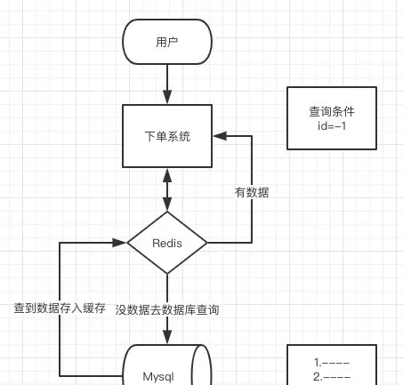
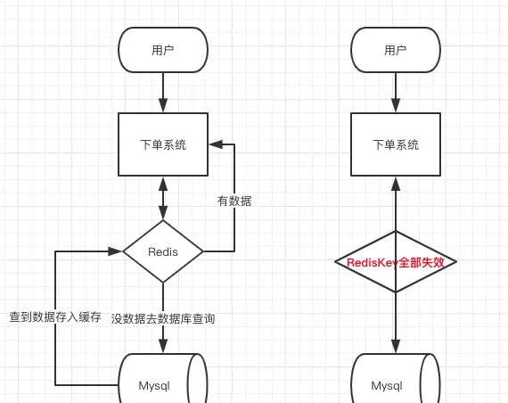

## 缓存穿透，雪崩，击穿以及解决方案分析

## 前言

作为一种非关系型数据库，redis也总是免不了有各种各样的问题，这篇文章主要是针对其中三个问题进行讲解：缓存穿透、缓存击穿和缓存雪崩，并给出一些解决方案。

## 一. 什么是 缓存穿透

缓存穿透是指查询一个一定不存在的数据，由于缓存是不命中时被动写的，并且出于容错考虑，如果从存储层查不到数据则不写入缓存，这将导致这个不存在的数据每次请求都要到存储层去查询，失去了缓存的意义。在流量大时，可能DB就挂掉了，要是有人利用不存在的key频繁攻击我们的应用，这就是漏洞。

**小点的单机系统，基本上用postman就能搞死，比如我自己买的阿里云服务**



**像这种你如果不对参数做校验，数据库id都是大于0的，我一直用小于0的参数去请求你，每次都能绕开Redis直接打到数据库，数据库也查不到，每次都这样，并发高点就容易崩掉了。**

有很多种方法可以有效地解决缓存穿透问题。

1.最常见的则是采用布隆过滤器，将所有可能存在的数据哈希到一个足够大的bitmap中，一个一定不存在的数据会被 这个bitmap拦截掉，从而避免了对底层存储系统的查询压力。

2.另外也有一个更为简单粗暴的方法（我们采用的就是这种），如果一个查询返回的数据为空（不管是数 据不存在，还是系统故障），我们仍然把这个空结果进行缓存，但它的过期时间会很短，最长不超过五分钟。


## 二. 什么是 缓存雪崩

我了解的，目前电商首页以及热点数据都会去做缓存 ，一般缓存都是定时任务去刷新，或者是查不到之后去更新的，定时任务刷新就有一个问题。

**举个简单的例子**：如果所有首页的Key失效时间都是12小时，中午12点刷新的，我零点有个秒杀活动大量用户涌入，假设当时每秒 6000 个请求，本来缓存在可以扛住每秒 5000 个请求，但是缓存当时所有的Key都失效了。此时 1 秒 6000 个请求全部落数据库，数据库必然扛不住，它会报一下警，真实情况可能DBA都没反应过来就直接挂了。此时，如果没用什么特别的方案来处理这个故障，DBA 很着急，重启数据库，但是数据库立马又被新的流量给打死了。这就是我理解的缓存雪崩。

**我刻意看了下我做过的项目感觉再吊的都不允许这么大的QPS直接打DB去，不过没慢SQL加上分库，大表分表可能还还算能顶，但是跟用了Redis的差距还是很大**



**同一时间大面积失效，那一瞬间Redis跟没有一样，那这个数量级别的请求直接打到数据库几乎是灾难性的，你想想如果打挂的是一个用户服务的库，那其他依赖他的库所有的接口几乎都会报错，如果没做熔断等策略基本上就是瞬间挂一片的节奏，你怎么重启用户都会把你打挂，等你能重启的时候，用户早就睡觉去了，并且对你的产品失去了信心，什么垃圾产品。**

### 缓存雪崩解决方案

处理缓存雪崩简单，在批量往**Redis**存数据的时候，把每个Key的失效时间都加个随机值就好了，这样可以保证数据不会在同一时间大面积失效了！

## 三. 什么是 缓存击穿

为什么把缓存击穿拿到最后说，因为它最复杂也最难处理，解决方案也有很多种，大家要仔细看哦！

出现缓存击穿有以下这些可能

1. 这个跟**缓存雪崩**有点像，但是又有一点不一样，缓存雪崩是因为大面积的缓存失效，打崩了DB，而缓存击穿不同的是**缓存击穿**是指一个Key非常热点，在不停的扛着大并发，大并发集中对这一个点进行访问，当这个Key在失效的瞬间，持续的大并发就穿破缓存，直接请求数据库，就像在一个完好无损的桶上凿开了一个洞。
2. 就是这个值是数据库新增的，但是缓存中暂时还没有，这个时候刚好并发请求进来了，如果处理不当也会发生

### 缓存击穿解决方案

我们的目标是：尽量少的线程构建缓存(甚至是一个) + 数据一致性 + 较少的潜在危险，下面会介绍四种方法来解决这个问题：

## 1、使用互斥锁(mutex key)

业界比较常用的做法，是使用mutex。简单地来说，就是在缓存失效的时候（判断拿出来的值为空），不是立即去load db，而是先使用缓存工具的某些带成功操作返回值的操作（比如Redis的SETNX或者Memcache的ADD）去set一个mutex key，当操作返回成功时，再进行load db的操作并回设缓存；否则，就重试整个get缓存的方法。

```
String get(String key) {  

   String value = redis.get(key);  

   if (value  == null) {  

    if (redis.setnx(key_mutex, "1")) {  

        // 3 min timeout to avoid mutex holder crash  

        redis.expire(key_mutex, 3 * 60)  

        value = db.get(key);  
        redis.set(key, value);  
        redis.delete(key_mutex);  
    } else {  
        //其他线程休息50毫秒后重试  
        Thread.sleep(50);  
        get(key);  
    }  
  }  
}  
```

## 2、"提前"使用互斥锁(mutex key)：

在value内部设置1个超时值(timeout1), timeout1比实际的memcache timeout(timeout2)小。当从cache读取到timeout1发现它已经过期时候，马上延长timeout1并重新设置到cache。然后再从数据库加载数据并设置到cache中。伪代码如下：

```
v = rediscache.get(key);  
if (v == null) {  
    if (rediscache.setnx(key_mutex, 3 * 60 * 1000) == true) {  
        value = db.get(key);  
        rediscache.set(key, value);  
        rediscache.delete(key_mutex);  
    } else {  
        sleep(50);  
        retry();  
    }  
} else {  
    if (v.timeout <= now()) {  
        if (rediscache.setnx(key_mutex, 3 * 60 * 1000) == true) {  
            // extend the timeout for other threads  
            v.timeout += 3 * 60 * 1000;  
            rediscache.set(key, v, KEY_TIMEOUT * 2);  
            //load the latest value from db  
            v = db.get(key);  
            v.timeout = KEY_TIMEOUT;  
            rediscache.set(key, value, KEY_TIMEOUT * 2);  
            rediscache.delete(key_mutex);  
        } else {  
            sleep(50);  
            retry();  
        }  
    }  
}  
```

## 3、"永远不过期"：


这里的“永远不过期”包含两层意思：

> (1) 从redis上看，确实没有设置过期时间，这就保证了，不会出现热点key过期问题，也就是“物理”不过期。
> (2) 从功能上看，如果不过期，那不就成静态的了吗？所以我们把过期时间存在key对应的value里，如果发现要过期了，通过一个后台的异步线程进行缓存的构建，也就是“逻辑”过期

从实战看，这种方法对于性能非常友好，唯一不足的就是构建缓存时候，其余线程(非构建缓存的线程)可能访问的是老数据，但是对于一般的互联网功能来说这个还是可以忍受。

```
String get(final String key) {  
        V v = redis.get(key);  
        String value = v.getValue();  
        long timeout = v.getTimeout();  
        if (v.timeout <= System.currentTimeMillis()) {  
            // 异步更新后台异常执行  
            threadPool.execute(new Runnable() {  
                public void run() {  
                    String keyMutex = "mutex:" + key;  
                    if (redis.setnx(keyMutex, "1")) {  
                        // 3 min timeout to avoid mutex holder crash 
                        redis.expire(keyMutex, 3 * 60);  
                        String dbValue = db.get(key);  
                        redis.set(key, dbValue);  
                        redis.delete(keyMutex);  
                    }  
                }  
            });  
        }  
        return value;  
    }  
```

## 4、资源保护：

采用netflix的hystrix，可以做资源的隔离保护主线程池，如果把这个应用到缓存的构建也未尝不可。

**四种方案对比：**

   作为一个并发量较大的互联网应用，我们的目标有3个:

   1. 加快用户访问速度，提高用户体验。

   2. 降低后端负载，保证系统平稳。

   3. 保证数据“尽可能”及时更新(要不要完全一致，取决于业务，而不是技术。)

   所以第二节中提到的四种方法，可以做如下比较，还是那就话：没有最好，只有最合适。 

| 解决方案                     | 优点                                                   | 缺点                                                         |
| ---------------------------- | ------------------------------------------------------ | ------------------------------------------------------------ |
| 简单分布式锁(Tim yang)       | 1. 思路简单2. 保证一致性                               | 1. 代码复杂度增大2. 存在死锁的风险3. 存在线程池阻塞的风险    |
| 加另外一个过期时间(Tim yang) | 1. 保证一致性                                          | 同上                                                         |
| 不过期(本文)                 | 1. 异步构建缓存，不会阻塞线程池                        | 1. 不保证一致性。2. 代码复杂度增大(每个value都要维护一个timekey)。3. 占用一定的内存空间(每个value都要维护一个timekey)。 |
| 资源隔离组件hystrix(本文)    | 1. hystrix技术成熟，有效保证后端。2. hystrix监控强大。 | 1. 部分访问存在降级策略。                                    |

**当然在请求刚进来的时候，也需要做好多处理：**

在接口层增加校验，比如用户鉴权校验，参数做校验，不合法的参数直接代码Return，比如：id 做基础校验，id <=0的直接拦截等。

## 总结

本文简单的介绍了，**Redis**的**雪崩**，**击穿**，**穿透**，三者其实都差不多，但是又有一些区别，在面试中其实这是问到缓存必问的，大家不要把三者搞混了，因为缓存雪崩、穿透和击穿，是缓存最大的问题，要么不出现，一旦出现就是致命性的问题，所以面试官一定会问你。

大家一定要理解是**怎么发生的**，以及是怎么去**避免**的，发生之后又怎么去**抢救**，你可以不是知道很深入，但是你不能一点都不去想，面试有时候不一定是对知识面的拷问，或许是对你的态度的拷问，如果你思路清晰，然后**知其然还知其所以然**那就很赞，还知道怎么预防那肯定可以过五关斩六将。